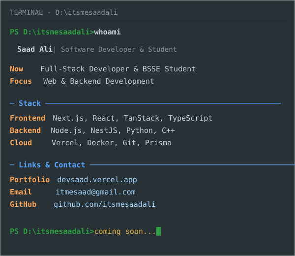

<table>
<tr>

<td>

<picture>
  <source media="(prefers-color-scheme: dark)" srcset="svg/dark/source-photo.svg">
  <source media="(prefers-color-scheme: light)" srcset="svg/light/source-photo-light.svg">
  
</picture>

</td>

<td>

<picture>
  <source media="(prefers-color-scheme: dark)" srcset="svg/dark/info-card.svg">
  <source media="(prefers-color-scheme: light)" srcset="svg/light/info-card-light.svg">
  
</picture>

</td>

</tr>
</table>

 

<picture>
  <source media="(prefers-color-scheme: dark)" srcset="svg/dark/projects-card.svg">
  <source media="(prefers-color-scheme: light)" srcset="svg/light/projects-card-light.svg">
  
</picture>

